<!-- portfolio:start -->
<p align="center">
  
</p>

<h1 align="center">Alfredo Ctrl</h1>

<p align="center"><strong>AI student, web builder, and daily project shipper.</strong></p>

<p align="center">

  
  
</p>

## Portfolio Signal

This profile is a living map of practical AI and web experiments: tools, demos, CLI utilities, visual systems, and case studies.

## What To Notice

Each repository is shaped as a different product world, so the portfolio shows range instead of repeating the same visual language.

## Current Direction

Building helpful, understandable tools around AI, programming workflows, visual interfaces, and student-friendly productivity.

## Portfolio Note

This repository has its own visual identity inside the portfolio. The goal is that every project feels like a different product, not another copy of the same template.
<!-- portfolio:end -->

---

## Existing Project Notes

<div align="center">


<br />

<a href="https://linkedin.com/in/alfredo-ramos-olivan-07751a3a5">
  
</a>
<a href="mailto:alfredooliva765498@gmail.com">
  
</a>
<a href="https://github.com/Alfredo-ctrl">
  
</a>


<br />
<br />

<strong>AI Engineering Student</strong> |
<strong>Web Developer</strong> |
<strong>Builder of Useful Tools</strong>

<br />

<sub>Juarez, Nuevo Leon, Mexico | Python | PyTorch | OpenCV | FastAPI | JavaScript | Three.js</sub>

</div>

---

## Current Signal

```txt
status       AI engineer in progress
focus        useful AI tools, computer vision, web products
building     CLIs, web apps, privacy-safe showcases, visual interfaces
style        clean systems, clear UX, portfolio-ready documentation
```

I build practical AI, web, and developer-tool projects with a focus on real users, safe publication, and interfaces that feel intentional.

## Featured Work

| Project | Type | Why it matters |
| --- | --- | --- |
| [CONAEMPLEO Showcase](https://github.com/Alfredo-ctrl/conaempleo-showcase) | Privacy-safe platform showcase | Public portfolio edition for an employability platform without exposing private student, company, or admin data. |
| [LifePilot](https://github.com/Alfredo-ctrl/lifepilot) | Web app + CLI | Personal planning assistant designed to make daily decisions easier and more organized. |
| [RepoDoctor](https://github.com/Alfredo-ctrl/repodoctor) | CLI tool | Audits repositories before publishing and flags missing docs, screenshots, setup steps, and obvious safety risks. |
| [Neural Style Transfer API](https://github.com/Alfredo-ctrl/neural-style-transfer-api) | AI API + web studio | Image style-transfer workbench with a practical API surface and visual interface. |
| [SignalForge AI](https://github.com/Alfredo-ctrl/signalforge-ai) | Telemetry review tool | Local telemetry analysis interface for turning raw signals into readable reviews. |
| [Vision Document Scanner](https://github.com/Alfredo-ctrl/vision-document-scanner) | Computer vision app | Document scanning workflow with image processing and a public demo interface. |

## Project Categories

| Category | Repositories |
| --- | --- |
| AI and Computer Vision | `neural-style-transfer-api`, `vision-document-scanner`, `signalforge-ai` |
| Web Applications | `conaempleo-showcase`, `lifepilot`, `briefsmith` |
| Developer Tools | `repodoctor`, `lifepilot` CLI |
| Privacy-Safe Showcases | `conaempleo-showcase` |

## What I Work With

<div align="center">

### Artificial Intelligence


<br />
<br />

### Web And Product


<br />
<br />

### Tools


</div>

## GitHub Workflow

This profile is maintained as an active learning portfolio:

- New projects are organized by date under `C:\Rutina_Proyectos_GitHub`.
- Public repositories include clear README files, run instructions, and visual previews when useful.
- Sensitive or real-world projects are published only as sanitized showcase editions.
- Curated stars and lists track AI, web motion, and developer-tool references worth studying.
- Web projects use motion intentionally, including strategic parallax when it improves the product feel.

## GitHub Pulse

<div align="center">


<br />
<br />

<picture>
  <source media="(prefers-color-scheme: dark)" srcset="https://github-readme-activity-graph.vercel.app/graph?username=Alfredo-ctrl&bg_color=0D1117&color=C9D1D9&line=38BDF8&point=A78BFA&area=true&area_color=0A2540&hide_border=true&custom_title=Contribution%20Timeline" />
  <source media="(prefers-color-scheme: light)" srcset="https://github-readme-activity-graph.vercel.app/graph?username=Alfredo-ctrl&bg_color=FFFFFF&color=1F2937&line=0A66C2&point=6366F1&area=true&area_color=DBEAFE&hide_border=true&custom_title=Contribution%20Timeline" />
  
</picture>

</div>

---

<div align="center">

<strong>Building practical AI and web tools, one useful repository at a time.</strong>

</div>
