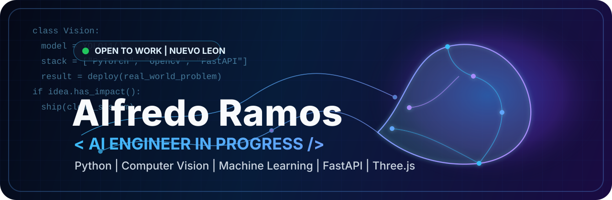

<div align="center">



<br />

<a href="https://linkedin.com/in/alfredo-ramos-olivan-07751a3a5">
  
</a>
<a href="mailto:alfredooliva765498@gmail.com">
  
</a>
<a href="https://github.com/Alfredo-ctrl">
  
</a>


<br />
<br />

<strong>Estudiante de Ingenieria en Inteligencia Artificial</strong> |
<strong>Desarrollador de IA y Web</strong> |
<strong>Computer Vision Builder</strong>

<br />

<sub>Juarez, Nuevo Leon, Mexico | Open to work | Python | PyTorch | OpenCV | YOLO11 | FastAPI | Three.js</sub>

</div>

---

## Current Signal

```txt
status       AI Engineer in Progress
focus        Computer Vision, applied ML, full-stack AI products
building     FastAPI backends, visual interfaces, detection pipelines
style        clean systems, sharp UI, useful automation
```

I build software where AI is not just a demo layer. My sweet spot is connecting models, APIs, data, and interfaces into tools that feel practical, fast, and ready for real users.

## What I Work With

<div align="center">

### Artificial Intelligence


<br />
<br />

### Web And Product


<br />
<br />

### Tools


</div>

## Featured Builds

| Project | What it says about me |
| --- | --- |
| [peoyecto-retail](https://github.com/Alfredo-ctrl/peoyecto-retail) | Computer vision for retail inventory classification. Practical AI, not just notebooks. |
| [vision-document-scanner](https://github.com/Alfredo-ctrl/vision-document-scanner) | Image processing workflow for document scanning and cleanup. |
| [excel-maniobras-descarga](https://github.com/Alfredo-ctrl/excel-maniobras-descarga) | Automation around operational spreadsheets and workflow pain points. |
| CONAEMPLEO | Full-stack job platform concept: auth, dashboard logic, matching flow, and production-style architecture. |

## Engineering Profile

```python
class AlfredoRamos:
    role = "AI Engineer in Progress"
    location = "Juarez, Nuevo Leon, Mexico"

    stack = {
        "ai": ["Python", "PyTorch", "OpenCV", "YOLO11", "scikit-learn"],
        "backend": ["FastAPI", "Node.js", "SQL"],
        "frontend": ["React", "Next.js", "Three.js", "Tailwind CSS"],
    }

    def current_focus(self):
        return [
            "computer vision systems",
            "AI-powered web applications",
            "clean APIs for real products",
            "interfaces that feel fast and intentional",
        ]
```

## GitHub Pulse

<div align="center">


<br />
<br />

<picture>
  <source media="(prefers-color-scheme: dark)" srcset="https://github-readme-activity-graph.vercel.app/graph?username=Alfredo-ctrl&bg_color=0D1117&color=C9D1D9&line=38BDF8&point=A78BFA&area=true&area_color=0A2540&hide_border=true&custom_title=Contribution%20Timeline" />
  <source media="(prefers-color-scheme: light)" srcset="https://github-readme-activity-graph.vercel.app/graph?username=Alfredo-ctrl&bg_color=FFFFFF&color=1F2937&line=0A66C2&point=6366F1&area=true&area_color=DBEAFE&hide_border=true&custom_title=Contribution%20Timeline" />
  
</picture>

</div>

---

<div align="center">

<strong>Building the future one useful model, API, and interface at a time.</strong>

</div>
